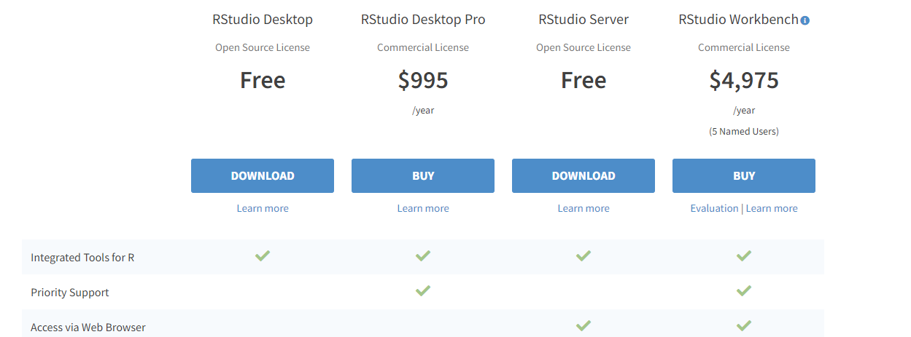

```{r setup, include=FALSE}
knitr::opts_chunk$set(echo = TRUE)
# Altera a posição do caption das figuras
library(knitr)
knit_hooks$set(plot = function(x, options) {
  paste('<figure><figcaption>', options$fig.cap, '</figcaption></figure>',
        sep = '')
})

```
---

# Aspectos gerais do R

No sítio oficial do R project  (https://www.r-project.org/), é possível encontrar inúmeras informações sobre o ambiente, literatura relacionada e contribuições em diversas formatos.

{ width=70% }

No sítio do R project, na guia lateral esquerda, destaca-se o CRAN que é a rede de distribuição do R (*Comprehensive R Archive Network - CRAN*) formada por vários *mirrors* ou espelhos que são servidores localizados em diversos países que armazenam os arquivos de instalação do R e de seus diversos pacotes adicionais.

Para baixar os arquivos de instalação, um *mirror* deve ser escolhido. Normalmente se escolhe um no país em que se está localizado em decorrêancia da proximidade.

## Pontos fortes e fracos do R

|Pontos fortes| Pontos fracos|
|--------|----------|
Fácil de programar| Não possui menu guia de comandos|
Gratuito| sem garantia de suporte|
Muitas funções| As vezes, são difíceis de encontrar as funções|
Muito flexível| Muitas opções podem confundir|
Excelente capacidade gráfica| Leva algum tempo para aprender|

## Para instalar o R

O executável de instação do R, para a plataforma Windows, pode ser descarregada da rede de distribuição do R (Comprehensive R Archive Network - CRAN) que é  hospedado no seguinte endereço:

https://cran.r-project.org/


{ width=70% }

Há opções de instalaçães nas plataformas  Windows, Linux ou MAC. Para a plataforma Windows siga os seguites passos:

 1.  CRAN -> seleciona CRAN Mirrors (Preferencialmente um do Brasil) 
 2.  Download R for Windows -> base -> Download R 4.0.3 for Windows (versão em 26/11/2020)
 3.  Baixar, instalar com as configurações sugeridas pelo instalador (*default*)
 
Após a instação, basta clicar sobre o ícone do R para que a sua interface gráfica seja aberta que é a face do R ou o R GUI (*Graphical User Interface - GUI*), também denominado popularmente como R básico.

{ width=70% }


O GUI permite do usuário interaja com o programa; todavia, essa interação pode ser mais amigável e intergrada mais facilmente com outros recursos quando realizada a partir do RStudio cuja instalação será descrita a seguir:


## Para instalar o RStudio

O RStudio é uma interface de desenvolvimento integrada (IDE) que atua conjudado com o R, facilitando as operações e integrações com outros recursos como o Rmardown. Possibilita desde o preenchimento automático de palavras (o que ajuda muito), a criação de relatórios em formatos como HTML, PDF, Word e PowerPoint, e a criação de novos pacotes.


Para a sua instalação, siga as instruções abaixo:

  1. No navegador escreva "rstudio download" que será exido o sítio para descarrear o executável de instalação ou utilize o endereço o seguinte endereço

 https://www.rstudio.com/products/rstudio/download/

  2. Estão disponíveis versões comerciais e uma versão gratuita. Opte pela versão RStudio Desktop Open Source License (FREE).

{ width=70% }


 3. Windows 10/8/7
 4. Basta clicar no botão de download
 5. Baixar, instalar com as configurações sugeridas pelo instalador


## Tutoriais
Atualmente há diversos materiais instrucionais sobre o R em Português na internet. O vídeo [Como organizar um Projeto no R Studio?](https://youtu.be/0NbAKipZ6sU) é muito útil e foi disponibilizado por Gustavo B Paterno no Youtube.


## Citação

### Citação do R

O comando `citation()` permite exibir as referências do R e dos pacotes, inclusive com o entrada Bibtex para Latex.

```{r}
citation()
citation("stats") # referencia de pacote
```

Para a referenciar do RStudio, use

```{r, eval=FALSE}
RStudio.Version()
```

## Pacotes

Pacotes são conjuntos de funções e dados destinados a determinado propósito. Quando o R é instalado, já vem com um conjunto de pacotes básicos instalados.

Para exibir os pacotes instalados, digite o seguinte comando no console:


```{r, eval=FALSE}
library()
```

No R Studio, para exibir os pacotes instalados, alternativamente, pode-se simplmente clicar na aba **Packages**, no canto inferior esquerdo.

### Carregando pacotes

Mesmos que os pacotes já estejam instalados, para que seus recursos sejam ativados, precisam ser carregados, o que pode ser realizado por um dos comandos a seguir:

```{r, eval=FALSE}
library(nome.do.pacote)
require(nome.do.pacote)
```
O RStudio oferece uma segunda opção de carregar pacote por meio da aba **Packages**, no canto inferior direto. Clique nessa aba, que exibirá os pacotes instalados, e marque o pacote que deseja carregar.

Para "descarregar" um pacote, deigite:

```{r, eval=FALSE}
detach(package:nome.do.pacote)
```


### Instalação de pacotes
Exitem, no entanto, diversos pacotes para os mais variados fins. Para utilizar os recursos desses pacotes, eles devem ser instalados e, posteriormente, carregados.

Os pacotes ficam armazenados em repositórios (*repository*). Os repositórios mais populares são:

  - **CRAN** (<https://cran.r-project.org/>) que é o repositário oficial do R, no qual os pacotes, passam por um processo de revisão antes de estarem disponíveis para instalação;
  - **Github**  (<https://github.com/>) que é um repositório popular de projetos *open source* cada vez mais utilizado por desenvolvedores de R. Deve-se apenas ter precaução com os pacotes do Github pelo fato de não passarem por processo de revisão, uma vez que são oferecidos diretamente por seus autores.

A maior parte dos pacotes do R estão hospedados no CRAN (<http://cran.r-project.org>). Em 15/01/2020, havia 18733 pacotes no CRAN.


No RStudio, há três maneiras de instalar pacotes: duas formas de instalar da internet, digitando o comando `install.packages()` (igual no R básico), por meio da aba `Packages` e uma a partir de um arquivo armazenado localmente.


#### Instaçãon de pacotes do CRAN
A primeira, envolve  a digitação do comando de instalação de um pacote cuja a sítese é a seguinte: 

```{r, eval=FALSE}
install.packages("nome.do.pacote")
```

Por exemplo, para instalar o pacote `car`, digite:


```{r, eval=FALSE}
install.packages("car")
```

O R ou o R Studio abrirá uma janela para a seleção do Mirror do qual você deseja baixar o pacote. Escolha o Mirror mais próximo, apesar de que, atualmente, isso não faz muita diferença, por causa da velocidade da internet. Em seguida, a instalação deve ocorrer sem problemas.

Caso o pacote já tenha sido instalado anteriormente, esse procedimento irá somente atualizá-lo.

Caso se deseje instalar mais de um pacote num único comando, pode-se reunir os nomes inserido na função `c("pacote1", "pacote2", ...)`, como a seguir:


```{r, eval=FALSE}
install.packages(c("car","readxl"))
```

Uma segunda maneira de instalar no RStudio, consiste em, na janela inferior direita, selecionar a aba **Packages**, depois clicar em **Install**. Uma janela de instalação direto do CRAN com um espaço para digitar o pacote desejado. A medida em que a palavra é digitada, é oferecida uma lista de pacotes cujos nomes se encaixam com as letras que vai sendo exibida. Basta selecionar o pacote dejesado em clicar no botão **install**. 


{ width=50% }


#### Instação de pacotes locais

Uma terceira maneira de instalar pacotes consiste em os obter de fontes locais, como um diretório do computador ou armazenados em um pendrive, o que pode ser muito útil em situação de dificuldades de acesso à internet. Repete-se o mesmo caminho para instação de pacote: selecionar a aba **Packages**, depois clicar em **Install**. Na Janela de instação, clicar aguia de seleção **Install from:**, naqual é possivel alternar entre insatalar do CRAN e de arquivos comprimidos nos formatos .zip e tar.gz. Nesse momento, o uma janela de navegação é aberta para se selecionar o pacote desejado.


{ width=50% }

<br>

#### Instação de pacotes do GitHub
Há duas maneiras simples de instalar pacotes do GitHub:

  - uma com a função `install_github()` do pacote `devtools` e
  - outra com a função `githubinstall` do pacote `githubinstall`.
  
A diferença entre ambos reside na necessidade de indicar o nome do desenvolvendor, exigido no primeiro.

Para utilizar o comando `install_github()`, primeiro é necessário instalar o pacote `devtools`, a sintaxe e um exemplo, são apresentados abaixo:


```{r, eval=FALSE}
install.packages("devtools")
devtools::install_github("nome-do-repo/nome-do-pacote")
devtools::install_github("rstudio/shiny")
```

Atenção para a necessidade de indicar que o pacote `shiny` é desenvolvido por **rstudio**.

Para utilizar o comando `githubinstall()`, primeiro é necessário instalar o pacote `githubinstall`, a sintaxe e um exemplo, são apresentados abaixo:

```{r, eval=FALSE}
install.packages("githubinstall")
library(githubinstall)
githubinstall("shiny")
```

Como se pode observar, não há a necessidade de indicar o nome do desenvolvedor.

Se o houver vários desenvolvedores que tenham pacotes com o mesmo nome, o comando retorna uma lista de pacotes relacionados por desenvolvedor, para que você escolha de quem deseja baixar.

O pacote `githubinstall` possui os comandos `gh_suggest_username()` e `gh_search_packages()`, o primeiro sugere um nome de pacote quando não lembra exatamente a escrita e o segundo retorna uma relação de pacotes que contenham palavras-chave, dipsoníveis no GitHub.`

```{r, eval=FALSE}
gh_suggest_username("hadly") # sugere nome

# lista de pacotes a partir de palavra chave
busca_packages <- gh_search_packages("experiment")
View(busca_packages)
```

### Removendo pacotes

O comando `remove.packages("")` remove pacotes.

```{r, eval=FALSE}
remove.packages("beyonce")
```

### Atualização de pacotes

Os comando `old.packages()` retorna uma relação de pacotes desatualizados:

```{r, eval=FALSE}
old.packages()
```

Para atualizar pacotes, pode utilizar três opções: (*a*) reinstalando um pacote específico com `install.packages()`, (*b*) atualizando todos com `update.packages()`, esses dois escrenvendo no console todos no console, ou (*c*) utilizando o botão **Update** na aba **Packages** no terminal do RStudio


```{r, eval=FALSE}
install.packages("stats") # atualiza pacote
update.packages()         # atualiza todos
```

---

## Comandos de operação básicas

|Comando    |	Ação                      |
|-----------|------------------------------------------------|
|`getwd()`|Exibe o diretório de trabalho|
|`ls()`|Lista todos os objetos da área de trabalho atual|
|`ls(pat="m")`|	Lista objetos com "m" no nome (pat = pattern)|
|`ls(pat="^m")`|	Lista objetos que iniciam com "m"|
|`rm(x)`|	Remove o objeto x|
|`rm(x,y)`|Remove os objetos x e y|
|`rm(list=ls())`|Remove todos os objetos da área de trabalho|
|`rm(list=ls(pat="^m"))`|	Remove objetos que começam com "m"|
|`library()`|	Mostra todos os pacotes instalados|
|`library(pacote)`|	Carrega pacote|
|`example(comandoX)`|	Mostrar exemplos do "comandoX"|
|`ls("package:base")`|	Listar as funções e operações contidas no pacote base do R|
|`help(comandoX)`|	Obter ajuda sobre o comando X


## Ajuda

Para obter ajuda sobre algum comando, basta digitar `help(comando)` ou `?comando`, como no exemplo a seguir em que se pede ajuda sobre o comando `sqrt`.

```{r, eval=FALSE}
help(sqrt) # ajuda
?sqrt      # mesmo que help
```

Os tópicos que são exibidos na ajuda, por padrão, são os seguintes:

Geralmente, o arquivo de help do R possui descrições e explicações detalhadas sobre as funções, com exemplos que valem a pena repetir. Os tópicos básicos da ajuda do R são os seguintes:

1. **Description**: decreve de maneira breve o uso do comando;
2. **Usage**: explica como o comando deve ser utilizado e como seus argumentos podem ser especificados;
3. **Arguments**: explica os argumentos do comando;
4. **Details**: acrescenta algumas explicações sobre a aplicação do comando;
5. **Value**: lista os resultados (*output*) gerados pelo comando;
6. **Note**: acrescenta algumas observações;
7. **Authors**: referencia os autores do comando;
8. **References**: referências das obras utilizadas no *help* e no comando;
9. **See also**: outros comandos relacionados;
10. **Examples**: exemplos do uso do comando.

Quando não se sabe o nome de uma função, o comando `help.search()` ou `??`pode ser utilizado para exibir todas as funções que citem uma palavra em sua documentação. No exemplo a seguir, são listados todos as funções que contenham a palavra "mean" em algum texto de sua documentação.


```{r, eval=FALSE}
help.search("mean")
??mean # o mesmo que help.search()
```

Quando não se sabe o nome exato da função, uma alternativa é o uso do comando  `apropos()` que exibe a lista de funções que contenham o argumento informado como parte de seu nome. No exemplo a seguir que se buscam as funções cque contenham a palavra "mean" em seus nomes. Deve notar que a busca então é limitada aos nomes das funções enquanto `help.search()` faz a busca em toda a documentação, não somente no nome das funções.

```{r, eval=FALSE}
apropos("mean")
```

As vezes, é mais fácil aprender como se usa uma função por meio de exemplo. A função `exemple()` executa, no console, exemplos da função desejada, como demonstrado a seguir:

```{r, eval=FALSE}
example(mean)# exemplo da função mean

example(plot)# exemplos da função plot
```

A função `help.start()` abre uma janela de `help` com manuais, referências, materiais de ajuda do R para consulta.

```{r, eval=FALSE}
help.start()
```


# Operações matemáticas

## Aritmética

Os operadores aritméticos são apresentados na tabela abaixo, seguindos de alguns exemplos.

|Operador|Operação| 
|--|--|
|`+`|Soma|
|`-`|Subtração|
|`*`|Multiplicação|
|`/`|Divisão|
|`%/%`|Divisão (inteiro)|
|`^`|Potência|

Interessante ressaltar o operador de divisão inteira (`%/%`) calcula o quociente (parte inteira) de uma divisão e a potência que pode ser operado de duas maneiras (`^`) ou (`**`).

```{r}
1+2+3 # somando
2+3*4 # multiplicação
4/2+1 # divisão
9%/%2
3*3^2 # potência ^ ou **
2^3
8^(1/3) # Raiz cúbica
```

## Algumas funções matemáticas

Há deversas funções matemáticas disponíveis no R, dentre as quais, as mais comumente utilizadas são apresentadas a seguir.

|Função|Descrição| 
|------|-----|
|`sqrt()` |Raiz quadrada 
|`abs()`  |Valor absoluto 
|`exp()`, `log()`	|Exponencial($e^x$) e logaritmo natural 
|`log10()` |Logaritmo base-10 
|`factorial()` |Fatorial
|`choose()` |Binominal
|`combn()`  |Combinações
|`sin()` `cos()` `tan()` |Trigonométricas 
|`asin()` `acos()` `atan()`	|Trigonométricas inversas 
|`sinh()` `cosh()` `tanh()`	|Hiperbólicas 
|`asinh()` `acosh()` `atanh()` |Hiperbólicas inversas


```{r}
sqrt(4) # Raiz quadrada
pi # 3.141593 
exp(-2)
factorial(4)
choose(4,2)
combn(3,2) # Combinações de dois números de 1 a 3
```

---


# Objetos na Linguagem R
{ width=40% }
<br>

## Atribuição de Objetos
Atribuição (`<-` ou `=`) armazena o valor de uma variável num objeto, mas não apresenta o resultado na tela, é necessário chamar o objeto.

## Nome dos objetos
Os nomes das variáveis começam por uma letra (**X** diferente de **x**) e podem conter também algarismos e pontos. O R é *case sensitive*, isto é, diferencia maiúsculas de minúsculas. 

Ex: x, X, meus.dados, meus_dados, dados1

Nomes a evitar (usados internamente pelo sistema):

c, q, t, C, D, F, I, T, pi, diff, df, pt,
FALSE, TRUE, Inf, NA, NaN, NULL, break, else, for,
function, if, in, next, repeat, while, LETTERS,
letters

## Gerenciando Objetos
O R é cpaz de criar e manipular os objetos que estão armazenados na memória. A seguir, algumas as funções que listam e eliminam objetos.


|Função | Descrição |
|:------|-------|
|`ls()`, `objects()` | listar os objectos
|`rm(obj1, obj2,...)` | eliminar objectos
|`rm(list=ls())` | eliminar todos os objetos

### Funções que exibem atributos dos objetos

- `names()`, `dimnames()`
- `dimensions()` (ex. matrices, arrays)
- `class()`
- `length()`
- `attributes()`
- `str()`


```{r}
x<-10
x
x<-10+5
x
```

A função `ls()` lista os nomes dos objetos armazenados na memória.

```{r}
nome<-"Maria"
n1 <- 10;n2 <- 100;m <- 0.5
ls()
ls(pat="m")
ls(pat= "^m")
rm(nome)
ls()
rm(list = ls())
ls()
```


### Tipos de dados no R

 1. character: são dados alfanumérico (letras e números), sendo intoduzindos e apresentados entre aspas. Como não entendidos como texto pelo R, os números introduzidos como alfanuméricos não estão disponíveis para operações matemáticas.
 2. numeric: são os números que podem assumir qualquer valor, tratando-se de pontos flutuantes.
 3. integer: não números inteiros. Para declarar uma dado como interiro, pode acrescetar o sufixo **L** ou utilizar a função `as.integer()`.
 4. logic: é o resultado de comparação entre variáveis e podem assumir os seguintes valores: `FALSE` e `TRUE`, `F` e `T` ou `0` e `1`.
 5. complex: são números com uma parte real e outra imaginária, podendo ser criado, acrescentando-se o sufixo **i** à parte imaginária ou como resultado de uma operação.
 
```{r}
x <- c("a", "b", "1", "2") # dados alfanuméricos
class(x)

# Numéricos
x<-c(1,2,3)
x
class(x)

# Inteiros
x <- 4L
y <- as.integer(3)
class(y)
class(x)
as.integer(2.24)      # somente parte inteira
x<-as.integer("2.24") # transforma (coerce) dados
class(x)

# dados lógicos
x <- 2; y <- 3
w <- x > y      # x é maior do que y? 
w               # valor lógico da comparação

x  <- 4L
is.numeric(4)
is.integer(4) # afinal é um ponto flutuante

# dados complexos
x <- 3 + 2i
x
class(x)
sqrt(-1)              # produz erro porque -1 não é complex
sqrt(−1+0i)           # operação com complexo
sqrt(as.complex(−1))  # resultado igual
```


## Estruturas de dados

{ width=70% }
<br>


### Vetores

```{r}
x<-c(40,66,51,10,12)
class(x)
length(x)
str(x)

x[2]
x[1:3]
x[x<50]
```
#### Criando vetores com sequências
- rep(x, vezes)
- seq(de, até, incremento(by)/extensão(length))

```{r}
x3 <- 1:10
x4 <- seq(0,10, by=2)
x4[x4<5]
x4<5
x <- c(0:10, 50)
seq(0,10, length=11)
rep(1,times = 5)
rep(1,5)  # mesmo que rep(1,times = 5)
```

O comando `rep(x, times, each, length)` repete os elementos de x vezes (times).
A seguir, primeiramente, o comando repete o número 1 duas vezes. Depois, repete a sequencia de 1 a 3 duas vezes. Finalmente, repete o número 1 três vezes e o número 2 cinco vezes.

```{r}
rep(1, times=2)
rep(1:3, times=2)
rep(c(1,2),times=c(3,5))
```


O resultado anterior pode ser obtido, informando que se deve repetir 2 vezes paras os 3 números `rep(2,3)`, mas como veremos o argumento `each` é mais simples.

```{r}
rep(1:3, rep(2,3))
```

Com o argumento `each`, primeiro se repete depois se passa para o próximo número de **x**. Note a diferença desta instrução para a anterior, `rep(1:3, times=2)`.

```{r}
rep(1:3, each = 2)
rep(1:3, each = 2, len = 4)    # somente os 4 primeiros.
```


Veja os comandos a seguir.
```{r}
rep(1:3,times=5)
rep(1:3,rep(5))
rep(1:3,rep(5,3))  # mesmo que rep(1:3, each=5)
rep(1:3,5)
```

É possível controlar a repetição de cada elemento de x usando `c()`

```{r}
rep(1:4, times= c(2,2,2,2))     # igual a each=2
rep(1:4, times= c(2,3,4,2))     # repetição variada para cada elemento de x
```

Pode-se controlar a extensão dos resultados com `length` ou `len`.

```{r}
rep(1:4, each = 2, len = 4)    # repete 2x cada até completar 4 elementos
```

O R recicla os elementos até completar a extensão desejada

```{r}
rep(1:4, each = 2, len = 10)   # 2x cada até completar 10 elementos
rep(1:4, each = 2, times = 3)  # extensão 24, 3 reciclagens completas
```

### Data-frames

Um Data-frame é uma lista de variáveis com a mesma extensão.

```{r}
df<-data.frame("estado"=c("Pará", "Amazonas","Roraima"),
               "sigla"=c("PA","AM","RR"),
               "num.empresas"=c(2,4,3))
df
df$estado     # variável
df[2]         # variável
df[3,2]       # elemento
df$estado[1]  # elemento

names(df)
str(df)

# Data frame a partir de outros objetos
fornecedor<-rep(c("A","B"), each=3)
fornecedor
valor<-c(100,200,150,300,100,200)
data.frame(fornecedor,valor)
```

### lists

As listas (*lists*) são objetos com outros objetos que podem ser de diversas classes e de diferentes dimensões. Para referenciar um membro da lista, usa-se duplos colchetes "[[]]".

```{r}
numeros <- c(1, 2, 3)                  # numeric
nomes <- c("Joao", "Maria")            # character
testes <- c(TRUE, FALSE, FALSE, FALSE) # logic
x <- list(numeros, nomes, testes)
x
x[[2]]
x[[2]][1]
```

### tibbles

A tibble são estruturas de dados que se parecem com data.frames, mas com recursos adicionais, constituindo uma evolução dos data frames para um apresentação mais amigável.

Essa estrutura de dados pertence ao pacote tibble que, por sua vez, está incluso no populares pacotes tidyr e tidyverse. Na demonstração a seguir, caso ainda não tenha tenha sido instalado nenhum desses pacotes, será necessário instalar apenas o primeiro, `install.packages("tibble").

As formas mais comuns de se criar tibbles são por meio da função `tibble()` e por conversão de um objeto com a função `as_tibble()`.

```{r}
library(tibble)

tibble(
  a = c(2,2,2),
  b = c(1,2,3))

df <- data.frame(
  a = c(2,2,2),
  b = c(1,2,3))


class(df)
tb <- as_tibble(df) # convertendo
class(tb)
```

Pode-se observar que uma tibble é exibida com informações da classe da estrutura, tibble, as dimensões (no exemplo 3 linhas e 2 colunas), e os tipos das variáveis (chr e num).

Como as tibbles são alternativas mais avançadas dos que os data frames, os demonstrações a seguir enfatizam as distições entras as estuturas de dados.

As tibbles permitemtem que os nomes das colunas usem formatos não válidos no R, não precisam iniciar com letras, podem conter caracteres como o espaço, ou serem números, caso estejam escritas entre acentos agudos.

Exite a altertiva de se utilizar o `tribble()` (*transposed tibble*) para se entrar com dados, com os nomes das variáveis no topo, definidas por "~" e as colunas de dados separadas por vírgulas.

```{r}
tb <- tibble(
   `:)` = "sorria",
   ` ` = "espaços",
   `2020` = "um número")
tb


tribble(
   ~Obs, ~a, ~b,
   #--|--|----
   "obs. 1", 2, 1,
   "obs. 2", 2, 2,
   "obs. 3", 2, 3
 )
```

Uma outra vantagem muito interessante da tibble em relação ao data frame é que a primeira é criada senquencialmente, permitindo criar colunas com base em dados disponíveis em colunas anteriores, enquanto, no data frame, isso não é possível por ser criado em bloco, logo não é possível, num único passo, criar uma coluna com base em dados de colunas criadas na mesma função.

```{r, eval=FALSE}
data.frame(
  a = c(2,2,2),
  b = c(1,2,3),
  soma = a+b)
```

```{r, echo=FALSE}
cat("Error in data.frame(a = c(2, 2, 2), b = c(1, 2, 3), soma = a + b) : object 'a' not found")
```


Não foi possível executar a função porque a coluna `soma` exige dados em colunas ainda não criadas.

Para inserir a terceiras coluna no data frame, é necessária uma etapa acidional.


```{r}
df <- data.frame(
  a = c(2,2,2),
  b = c(1,2,3))

df$soma <- df$a+ df$b
df
```


Já no caso da tibble, **a** e **b** são criadas antes da **soma**, permitindo a criação desta com base nas colunas criadas anteriormente.

```{r}
tibble(
  a = c(2,2,2),
  b = c(1,2,3),
  soma = a+b)
```


Uma diferença marcante na exibição dos dados de uma tibble em relação aos data frames é a sua capacidade de ajustar ao console enquanto o data frame exibe todos os dados poluindo a janela quando há granda quantidade de observações. Para exmplificar, a diferença entre ambos, tome-se o banco de dados iris que disponível no R, que está originalmente armazenado em forma de data frame e exibi-lo também após ser convertido em tibble.

O iris é um banco de dados com 150 observações e, para economizar espaço neste texto, serão exibidas somente as 20 primeiras, mas, no computador do usuário serão exibidas as 150 quando o data frame iris for chamado no console.

```{r, eval=FALSE}
data("iris")
class(iris)
iris
```

```{r, echo=FALSE}
data("iris")
class(iris)
head(iris, n=20)
```
Após conversão em tibble, a exibição se limita a um máximo de 10 observações e com as colunas ajustadas ao console do usuário. A apresentação do número de oservações não exibidas vem no final.

```{r}
iristb <- as_tibble(iris) # conversão
iristb
```

Algumas funções construídas para data frames podem não funcionar com tibbles e a razão está no fato de que, na maioria das vezes, o data frame retorna  vetores de dados numéricos ou alfanuméricos, quando são chamados, enquanto que uma tible retorna uma tibble na maioria das chamadas de dados, de modo que a estrutura de dados recebida pela função pode ser a esperada, conduzindo ao erro de execução.

A seguir serão demonstradas as estruturas de dados retornados por data frames e tibbles conforme o tipo de chamada de dados. Primeiro são criados dois banco de dados no formato data frame e no formato tibble, depois, a coluna **a** é chamada de diversas maneiras e indicando a classe do respectivo retorno

```{r}
# data frame
df <- data.frame(
  a = c(2,2,2),
  b = c(1,2,3))

# tibble
tb <- tibble(
  a = c(2,2,2),
  b = c(1,2,3))

df
tb

df[,1]
tb[,1]
```


A seguir, são demonstradas as chamadas de coluna de data frame que retornam vetores numéricos ou alfanuméricos.

```{r}
# Data frame retorna vetor
class(df[,1]) # vetor numeric/sring
class(df[["a"]]) # vetor numeric/sring
```

Agora as chamadas de coluna de data frame que retornam data frames.

```{r}
class(df["a"]) # data frame
class(df[1]) #  data frame
```

A seguir, são demonstradas as chamadas de coluna de tibble que retornam tibble.

```{r}
class(tb[,1]) # retorna tibble
class(tb[1]) #retorna tibble
class(tb["a"]) #retorna tibble
```

Finalmente, as chamadas de coluna de tibble que retornam vetores numéricos ou alfanuméricos.

```{r}
class(tb[[1]]) # vetor numeric/string
class(tb$a) # vetor numeric/string
```


# Importação e exportação de dados

Dois aspectos importantes a serem observados na importação e exportação de dados são as características do banco de dados e a sua localização.

Se os dados a serem importados estiverem no diretório de trabalho (*Working Directory*) ou se serão salvos nele, não há necessidade de informações adicionais e o arquivo pode ser chamado pelo nome, como **"arquivo.txt"**, do contrário, a sua localização deve ser indicada junto com seu nome, por exemplo, **"C:/usuarios/nome/pasta/arquivo.txt"**.

Atenção para o Windows, utiliza barras investidas para indicar o caminho dos arquivos e diretórios. Logo, se o caminho for copiado do Windows, provavelmente, será colado **"C:\\usuarios\\nome\\pasta\\arquivo.txt"**, de forma que as barras precisam ser substitutídas por barras comuns ou utilizar barras investidas duplas: **"C:\\ \\ usuarios\\ \\  nome\\ \\ pasta\\ \\  arquivo.txt"** para que sejam interpretadas corretamente como caminho pelo R.

Assim, sempre é prudente estar certo da localização de seus dados e de seu diretório de trabalho para não se perder tempo. Seu diretório de trabalho é exibido pelo seguinte comando `getwd()`.

Com relação às características dos dados, deve-se observar o tipo do de arquivo, se estão em formato txt, excel ou outro, e como os dados estão gravados, se possuem rótulos, como estão separados e qual o separador de decimal, vírgula ou ponto.

## Importação de dados do excel

### Usando pacote readxl

Uma maneira mais prática de importação de dados é por meio do pacote **readxl** que permite importação de dados de dados armazenados em txt, Excel, SPSS, SAS e STATA.

Para importar dados em planilhas do Excel na janela, deve-se clicar na botão **Import Dataset**, na aba **Environment** localizada na janela superior direita do terminal do RStudio, e selecionar **From Excel...**


{ width=50% }
<br>

Um janela de navegação é aberta para encontrar o arquivo e abri-lo. O exemplo buscamos o arquivo [ **aditivo.xlsx**](dados/aditivo.xlsx) que está no diretório de trabalho atual.


O padrão (*default*) é a exibição dos dados da aba na posição 1 do Excel, no **Data Preview**. Pode ser observado que os dados são constitídos de duas colulas, na primeira linha estão os rótulos das variáveis, **aditivo**, identificada como texto (*character*), e **km** , identificada como numéricas (*double*). No **Data Preview**, pode-se visualizar até 50 observações.

{ width=50% }
<br>

A localização dos dados no arquivo pode ser alterada, na área de opções de importação (**Data Options**), detalhada a seguir:

  - **Name**: nome do objeto (tibber), para o qual será importado os dados. O padrão é que seja o mesmo nome do arquivo do Excel, mas pode ser alterado, digietando-se diretamente na caixa.
  - **Sheet**: aba do Excel em que estão os dados. O padrão é a aba na posição 1, mas para selecionar outra aba, deve-se clicar na guia que um lista das abas do arquivo são exibidas para seleção.
  - **Range**: faixa em que estão os dados que, é geralmente identificada automaticamente, podendo ser alterada. No exemplo, os dados estão da célular **A1** até a célula **D10**.
  - **Max Rows**: Espaço para indicar o número máximo de linhas desejado. Quando se deseja todos os dados, deve ser deixada em branco.
  - **Skip**: Quantas linhas deve pular para iniciar a faixa de dados. No exemplo a faixa de dados, inicia com os os rótulos das variáveis, portanto, não precisa pular nenhuma linha.
  - **NA**: Como são indicada as célular sem dados. O padrão é espaço vazio, mas pode vir informado de outra maneira, como "-" ou "N.A.".
  - **First row as Names**: O padrão é esteja selecionada indicando que a primeira linha contenha os nomes das variáveis. Caso contrário, se as variáveis não vierem com seus nomes na primeira linha da feixa, deve ser desmarcada.
  - **Open Data Viewer**: Opção para exibir os dados em janela separada.
  - **Code Preview**: Exibe o código que será rodado, conforme asa opções escolhidas e que pode ser copiada para ser utilizada em scripts posteriores sem a necessidade de executar todas as etapas novamente.

Para concluir a importação, resta clicar em *Import* que o RStudios cola e executa os comandos no console e exibirá os dados em janela separada se a opção **Open Data Viewer** tiver sido selecionada.

O pacote pomite ainda realizar a importação por meio de código. a sintase da função é:

```{r, eval=FALSE}
read_excel("caminho do arquivo/arquivo.xlsx")
```

A seguir são apresentados quatro exemplos, o primeiro supondo que o arquivo do nExcel está no diretório de trabalho, e, potanto, sem a necessidade de escrever cominho; o segundo supondo que o arquivo está num subdiretório do diretório de trabalho; o terceiro com o caminho completo do arquivo e o quarto, supondo que o arquivo esteja no diretório de trabalho, mas evidenciando alguns argumentos, como a posição da aba no Excel, no caso é a primeira (`sheet = 1`), que a primeira linha possui os nomes das variáveis (`col_names = TRUE`) e que os dados ausentes são indicados por céludas vazias (`na = ""`).


```{r, eval=FALSE}
library(readxl)

aditivo1 <- read_excel("aditivo.xlsx")

aditivo2 <- read_excel("dados/aditivo.xlsx")

aditivo3 <- read_excel("C:/Users/aless/OneDrive/Documents/Mestrado/IntroducaoR/aditivo.xlsx")

aditivo4 <- read_excel("aditivo.xlsx", sheet = 1, col_names = TRUE, na = "")
```


### Copiando

Há várias maneiras de importar dados do excel. Para importar dados do Excel via área de transferência, pode-se utilizar a função `read.table()`, com o argumento `file="clipboard`. Deve-se proceder da seguinte forma:

1. Selecione os dados que você deseja importar, inclusive os nomes das variáveis, e copie para a área de tranferência;
2. No R digite a seguinte instrução:

`dados <- read.table("clipboard", header=TRUE, dec=",")`

Se não selecionar os nomes das variáveis, deve-se ajustar o argumento `header=FALSE`.

Deve-se ter o cuidado para não haver espaços nos dados alfanuméricos, por exemplo, "Universidade Federal", porque o R, entenderá o espaço como quebra de coluna, provocando erro na leitura.


## importação de dados no formato R: load
Para importar dados do R com as extensões **.R**, **.rda** ou **.Rdata**, basta utilizar o comando `load()`. Por exemplo para importar os dados do arquivo [ **desc_morettin.Rdata**](dados/desc_morettin.Rdata).

```{r, eval=FALSE}
load("desc_morettin.Rdata")
head(dados)
View(dados)
```

Você pode observar o arquivo **.Rdata** é capaz de armazenar diversos objetos que são carregados no ambiente de trabalho. A seção 4.5 trata com mais detalhes esse essunto.

No exemplo, os arquivo está no diretório de trabalho, cado esteja noutro diretório, deve-se incluir o caminho completo no comando `load("C:/usuarios/nome/pasta/desc_morettin.Rdata")`. Um Erro muito comum entre usuários iniciantes é o esquecimento das aspas.


## importação de dados em arquivos .txt
Para importar arquivos no formato **txt**, use o comando `read.table()`. Caso o arquivo tenha o nome das variável na primeira linha, acrescente o argumento `header=TRUE`, uma vez que o *default* é `FALSE`. Se o separador de decimais for a vírgula, não o ponto, como no padrão americano, deve-se acrescentar argumento `dec=","`.

A seguir são importados os dados do arquivo **notas_AB.txt**](dados/notas_AB.txt):


```{r, eval=FALSE}
dados<-read.table("notas_AB.txt", header=TRUE, dec=",")  # ler dados em txt
dados
```

## importação de dados em arquivos .csv
Para importar arquivos no formato **csv** (*comma-separated values*), use o comando `read.csv()`. Caso o arquivo tenha os nomes das variável na primeira linha, não precisa acrescentar o argumento `header=TRUE`, já que esse é o *default*. Se o seperador de decimais for a vírgula, e não o ponto, como no padrão americano, deve-se acrescentar argumento `dec=","`.

A seguir são importados os dados do arquivo **notas_AB.csv**](dados/notas_AB.csv):

```{r, eval=FALSE}
dados<-read.csv("notas_AB.csv", dec=",") # ler dados em csv
dados
```

## Arquivos .Rdata: comandos save e load

O comando `save()` armazena vetores, outros objetos ou mesmo a área de trabalho criados no R num arquivo do tipo **.Rdata**. Os dados podem ser carregados pelo comando `load()` ou clicando no arquivo.

```{r, eval=FALSE}
x<-1:10
y<-x^2+10
save(x, y, file = "xy.Rdata")
rm(y,x) # remove objetos
load("xy.Rdata")

save.image("minhaArea.Rdata") # salva a área de trabalho
load("minhaArea.Rdata") # carrega área de trabalho
```

No primeiro exemplo, salvaram-se os objetos **x** e **y** no arquivo **xy.Rdata**. No segundo, todos os objetos da área de trabalho foram salvos no arquivo.

## Comandos dump e source

O comando `dump()` salva objetos num documento com extensao **.R** os quais podem ser lidos pelo comando `source()`

```{r, eval=FALSE}
cemDados<-1:100 # sequência de 1 a 100
dump("cemDados", file ="cem.R")  # salva objetos listados num arquivo.
rm(cemDados) # Remove objeto da área de trabalho

source("cem.R")                # carrega o arquivo
dump(list=objects(), file ="all.R") # todos os objetos
```

Uma utilidade interessante do comando `dump()` é a chamada de funções, que são sequências de instruções, criadas no R. Vamos chamar uma função simples, A seguir são importados os dados do arquivo [**minhaFuncao.R**](minhaFuncao.R): que conta os quantidade de elementos num vetor e calcular a média.

```{r}
umvetor<-c(5,7,9)
source("minhaFuncao.R")
minhaFuncao(umvetor)
```

Para os mais curiosos, a seguir, é apresentado o *script* da função `minhaFuncao.R`

```{r, eval=FALSE}
minhaFuncao<-function(x)
{
  n<-length(x)
  media<-mean(x)
  cat("número de elementos do vetor: ",n)
  cat("\nA média do vetor é: ", media)
  }
```

## Comandos write.table, read.table, write.csv e write.csv2

O comando `write.table()` permite a exportação de dados para vários formatos de arquivos. O argumento `sep =` determina o tipo de separador de dados, cujo padrão é `sep = " "`. Para dados separados por tabulações, o argumento é `sep = "\t"`. Já para dados separados por vírgulas, `sep = ","`. O argumento `dec="."` determina o separador de decimal que é o padrão, podendo ser alterado para vírgula.

Os camandos `write.csv` e `write.csv2` exportaram diretamente para o formato **.CSV**. Enquanto `write.csv` utiliza o "." como separador decimal e a vígula como separador de colunas, o comando `write.csv2` usa a vírgula como separdor decimal e o ponto e vírgula para separação de colunas, tornando mais fácil a exportaçãoo para planilhas de cálculo como o Excel.

Por *default*, `write.table()`, `write.cvs()` e `write.cvs2()` criam uma coluna extra com a indicação no número de observação dos dados. Para evitar a criação dessa coluna extra, deve-se ajustar o argumento `row.names=F`.

```{r, eval=FALSE}
write.table(dados, file="arquivo.txt", dec=".",row.names=F)
meuArquivo<-read.table('arquivo.txt',head=T) # Recupera dados

write.csv(dados, file="arquivo2.csv",row.names=F)
write.csv2(dados, file="arquivo3.csv",row.names=F)
```

Interessante é visualizar as exportações na área de trabalho. Procure e abra os arquivos gerados, **arquivo.txt**, **arquivo2.csv** e **arquivo3.csv**, clicando neles.


## Exportando outputs

## Exportanto outputs para TXT
Pode ser interessante exportar os resultados cálculos e testes para .TXT para visualização ou exportação posterior. O comando `sink()` direcionada o output para o arquivo com nome determinado

No exemplo a seguir, o resultado do comando `summary()` é armazenado no arquivo meuResumo.txt. Observe que antes da geração das estatísticas o separador de deciamis do R é alterado para vírgula para melhor visualização na padrão brasileiro. 

```{r, eval=FALSE}
# Salvar os resultados em txt com o comando sink()

sink("meuResumo.txt", append = F, split = T)
options(OutDec= ",")   # separador decimal com vírgula
resumo<-summary(dados)
resumo
sink() # encerra salvamento

options(OutDec= ".")  # restore default
```

O argumento `append = F` determina que um eventual arquivo anteriormente existente seja substituído. Caso o usuário deseje que os resultados sejam acrescentados em seguência no mesmo arquivo, deve optar por `append = T`. No exemplo a seguir, o mesmo resultado é acrescentado ao arquivo meuResumo.txt sem apagar o anterior, o que permite gerar um arquivos com diversos resultados.

```{r, eval=FALSE}
sink("meuResumo.txt", append = T, split = T)
options(OutDec= ",")
resumo
sink() # encerra salvamento

options(OutDec= ".")  # restore default
```


## Exercícios de importação e exportação de dados

1. Importe os dados no arquivo notas_AB.txt.
2. Importe os dados dos ensaios de vida útil de baterias contidos na aba **bateria** do arquivo  [**dadosPPE1.xlsx**](dados/dadosPPE1.xlsx). não deixe de importar o rótulo da coluna.
3. Salve os dados importados na questão anterior no formato **.RData** com o nome **bateria.RData** em sua área de trabalho.
4. Importe os dados da força de ruptura em libras por polegada quadrada para 100 garrafas descartáveis de 1 litro de refrigerante contidas na aba **forca** do arquivo **dadosPPE1.xlsx**. não deixe de importar o rótulo da coluna.
5. Salve os dados importados na questão anterior no formato **.R** com o nome **dadosForca.R** em sua área de trabalho, utilizando o comando `dump()`.
6. Há algum outro comando que poderia realizar a questão anterior além do comando `dump()`? Qual?
7. Importe os dados no arquivo [**cimento.Rdata**](dados/cimento.Rdata)


# Gráficos

O R possui poderosos e vastos recursos Gráficos que possibilitam incontáveis variações e possibilidades de análise de dados. Nesta seção será demonstrado os procedimentos básicos para elaboração de gráficos; todavia, há pacotes adicionais, como o `ggplot2` capazes de aumentar a capacidade de elaboração gráfica; todavia, o `ggplot2` será apresentado numa outra seção.

## Comando plot

O comando `plot(x,y,...)` pode criar gráficos a partir de uma única série de dados ou da combinação de dois conjuntos no forma de coordenadas x-y. A seguir são exemplificas os dois exemplos.


```{r}
x<-seq(1,20, by=2) # uma serie de dados
plot(x) # somente x
y<- 2+x^2
plot(x,y) # coordenadas x-y
```

O `plot()` pode ser personalizado por meio do ajuste de seus argumentos. A seguir, com os mesmos dados, geram-se gráficos de linhas, com características diferentes.

```{r}
par(mfrow=c(1,2)) # divide a janela gráfica 1 linha e 2 colunas
plot(x,y, type="l") # linha sólida (by default)
plot(x,y, type="l", col="red", lty=2, lwd=3)
par(mfrow=c(1,1)) # janela gráfica padrão
```

 O `type="l"` altera o tipo de gráfico para linha, `col=3` seleciona a cor vermelha, `lty=2` determina o uso de linha tracejada (*dashed*) e `lwd=3` multiplica por três a espessura da linha. O comando `par(mfrow=c(1,2))` divide a janela gráfica e  `par(mfrow=c(1,1))` retona ao padrão de um gráfico por janela.

O R pode gerar o plot gerar oito tipos de plots, controlados pelo argumento `type=`.

```{r, echo=FALSE,fig.cap="Tipos de linhas do plot", fig.pos="H"}
x <- c(1:5)
y <- x # create some data
par(col="blue") # plotting symbol and color 
par(mfrow=c(2,4)) # all plots on one page 
opts = c("p","l","o","b","c","s","S","h") 
for(i in 1:length(opts)){
  heading = paste("type=",opts[i]) 
  plot(x, y, main=heading, type=opts[i]) 
  }
```

### Tipos de linhas (*type*) 

Há seis tipos de linhas (`type="l"`) disponíveis configuráveis pelo argumento `lty` listadas a seguir.


```{r, echo=FALSE, out.width = "60%"}
#Line types
#++++++++++++++++++++++++++++++++++++++++++++
generateRLineTypes<-function(){
  oldPar<-par()
  par(font=2, mar=c(0,0,0,0))
  plot(1, pch="", ylim=c(0,6), xlim=c(0,0.7),  axes=FALSE,xlab="", ylab="")
  for(i in 0:6) lines(c(0.3,0.7), c(i,i), lty=i, lwd=3)
  text(rep(0.1,6), 0:6, labels=c("0.'blank'", "1.'solid'", "2.'dashed'", "3.'dotted'",
                                 "4.'dotdash'", "5.'longdash'", "6.'twodash'"))
  par(mar=oldPar$mar,font=oldPar$font )
}
generateRLineTypes()
```

### Tipos de pontos (*pch*)

Com o argumento `pch`, pode selecionar o tipo de ponto a ser utilizado, simplesmente indicnado o número correspondente ou símbolo desejado. A seguir são exidos os números dos símbolos básicos e alguns adicionais. Para especificar a cor, dos símbolos de 1 a 20, basta usat o argumento, `col=`, todavia, de 21 a 25, o argumento `col=` especifica a cor da borda e `bg=` a cor do preenchimento.

```{r, echo=FALSE}
generateRPointShapes<-function(){
   oldPar<-par()
   par(font=2, mar=c(1,1,2,1))
   y=rev(c(rep(1,6),rep(2,5), rep(3,5), rep(4,5), rep(5,5)))
   x=c(rep(1:5,5),6)
   plot(x, y, pch = 0:25, cex=1.5, ylim=c(1,5.5), xlim=c(1,6.5), 
        axes=FALSE, xlab="", ylab="")
   text(x, y, labels=0:25, pos=3)
   par(mar=oldPar$mar,font=oldPar$font )
 }
generateRPointShapes()
title("Códigos dos pontos (argumento \"pch\")")
```


```{r}
x<-seq(1,20, by=2) # sequencia
y<- 2+x^2

#  Gráfico de X Y personalizado
plot(x, y, xlab= "Dez números quaisquer", ylab= "Outros dez números", main= "Gráfico personalizado",xlim=c(0,20),ylim=c(0,500),col="blue", pch=21, bg="gray",tcl=0.4,las=1,cex=1.5,bty="L")

```

|Comando e seus parâmetros|Ação|
|---|-----------|
|`plot(x, y,`|plota x e y
|`xlab="Dez números quaisquer",`|nomeia o eixo x|
|`ylab="Outros dez números",`|nomeia o eixo y|
|`main="Como personalizar um gráfico",`|referente ao título|
|`xlim=c(0,25),`|limites do eixo x|
|`ylim=c(0,500),`|limites do eixo y|
|`col="red",`|define a cor dos pontos|
|`pch=22,`|o formato dos pontos|
|`bg="yellow",`|cor de preenchimento|
|`tcl=0.4,`|tamanho dos traços dos eixos|
|`las=1,`|orientação do texto em y|
|`cex=1.5,`|tamanho do objeto do ponto|
|`bty="L")`|altera as bordas ao redor do plot: "o","n","7","L","C","U"|

### Mais de um conjunto de dados no mesmo gráfico

É possível plotar mais uma linha no mesmo Gráfico. No exemplo a seguir, dois conjuntos de dados gerados aleatoriamente com o comando `runif()` são plotados no mesmo Gráfico. O comando `set.seet()` gera uma semente que força os resultados "aleatórios" serem iguais aos aqui demonstrados; caso contrário, os resultaos gerados por `runif()` serão diferentes. O argumento `ann=F` suprime os rótulos dos títulos e eixos e `axes=F` suprime as marcas (*tick marks*) de x e y do segundo Gráfico.

```{r}
set.seed(652) # semente
plot(runif(15),type="o",ann=F,xlim=c(0,20),col=4)
par(new=T)
set.seed(7174) # semente
plot(runif(20),type="o",ann=F,col=2,axes=F)
legend(15, 1, legend=c("1a linha","2a linha"), lty=c(1,1), col = c(4,2), lwd = 2)
```
A legenda é um componente gráfico adicional.

|Comando e seus parâmetros|Ação|
|---|-----------|
|`legend(15, 1,`|indica as coordenadas horizontal e vertical|
|`legend=c("1a linha","2a linha")`|texto em cada linha|
|`lty=c(1,1)`|Tipo de linha|
|`col = c(4,2)`|cor de cada linha|
|`lwd = 2`| multiplica a espessura das linhas por dois|

A seguir são apresentados outros componentes adicionais.

### Componentes Gráficos adicionais

Diversos componentespode ser acrescentados aos gráficos em geral, como linhas, objetos setas e textos. No quadro a seguir, listam-se os principais.  

|Comando|Descrição|
|---|-----------------------------------------------------------------------|
|`points(x,y, ...)`|adiciona pontos|
|`lines(x,y, ...)`|adiciona linhas|
|`text(x,y, ...)`|adiciona texto na área de plotagem|
|`abline()`| adiciona linha, horizontal se `h=`; verical se `v=` e em $y=a+bx$ se `a,b`|
|`polygon(x,y, ...)`|adiciona um polígono|
|`segments(x0,y0,x1,y1, ...)`|desenha linhas|
|`arrows(x0,y0,x1,y1, ...)`|desenha setas|
|`symbols(x,y, ...)`|desenha quadrados, círculos, etc.|
|`legend(x,y,legend=, ...)`|adiciona uma legenda|

Os argumentos opcionais definem cores, tamanho e outras características dos elementos adicionados.

Esses componentes podem ser demonstrados num gráfico em que são acrescentados livremente apenas para demonstração.

```{r}
x<-(1:10)^2
plot(x, type="l")
lines(rev(x),col=2)
points(rev(x))
lines(1:10,col=3)
points(1:10,pch=3) #adiciona cruzes
points(1:10,pch="$")#adiciona símbolo $
abline(h=mean(x),col=3, lty="dashed")
abline(v=5,col=4, lty="dotted", lwd=2)
text(7,90, "Linhas livremente\n tra?adas\n#~~~~~~~~~~#")
arrows(7,80,5.5,50)
arrows(7,80,7,50, col="blue",length=0.1,angle=40,lwd=3)
arrows(7,80,8,50, col="green",angle=40,lwd=3)
```

### Cores

O R possui uma paleta padrão com 8 cores que podem ser acessadas com a função `palette()`, as cores podem ser chamadas pelo nome em ingl?s ou pelo número que designa a sua posição na paleta. as cores são black (preto - 1), red (vermelho - 2), green3 (verde - 3), blue (azul - 4), cyan (ciano - 5), magenta (magenta - 6), yellow (amarelo - 7) e gray (cinza - 8), que podem ser listadas ao se digitar a função `palette()` no console.


As 657 nomes de cores personalizadas disponíveis no R podem ser acessados pelos comandos `colors()`e visualizadas no encarte [Colors in R](http://www.stat.columbia.edu/~tzheng/files/Rcolor.pdf) ou no [R color cheatsheet](https://www.nceas.ucsb.edu/~frazier/RSpatialGuides/colorPaletteCheatsheet.pdf).

```{r, eval=FALSE}
palette() # exibe as cores da paleta padrão
colors()  # exibe nomes de 657 cores
```

O R possui 6 grupos ou palestas de cores gradientes:

 - rainbow
 - heat.colors
 - tarrain.colors
 - topo.colors
 - cm.colors
 - gray.colors

```{r}
x<- -sin(3*pi*((1:20)-1/2)/20)
length(x)

plot(x, pch=21, main = "Plot sem cores nem efeitos")
plot(x, pch=21, cex=c(5,10,15), bg=rainbow(20, start = 0, end = .95, alpha = 0.5),ann = FALSE)
title("Cores com o uso do rainbow e\n círculos de diferentes tamanhos")
```

|Comando e seus parâmetros|Ação|
|------------------|----------------------------------------------|
|`plot(x`|plota os valores no gráfico|
|`pch=21`|usa o círculo como símbolo de plotagem|
|`cex=c(5,10,15)`|aumenta os tamanhos dos círculos 5, 10, 15 vezes|
|`bg`|cor de preenchimento dos círculos. O uso do argumento `col` com `pch=21` configura as cores da borda dos círculos, não o seu preenchimento|
|`rainbow(20`|usa 20 cores|
|`start = 0, end = .95`| combinações (matiz) de 0 a 0.95|
|`alpha`|nível de tranparência|


```{r}
plot(x, pch=21, cex=20, bg=heat.colors(20),ann = FALSE)
title("Cores com o uso do heat.colors e\n círculos grandes")
```

```{r}
plot(x, pch=21, cex=5, bg=terrain.colors(20),ann = FALSE)
title("Cores com o uso do terrain.colors e\n círculos médios")
```

```{r}
plot(x, pch=21, cex=5, bg=gray.colors(20),ann = FALSE)
title("Cores com o uso do gray.colors e\n círculos médios")
```

## Exercício de cores
 - Experimente as paletas `topo.colors` e `cm.colors` no gráfico anterior


## Gráfico de barras (Barplot)

O comando `barplot()` lê dados de vetores, com ou sem nome dos dados; de modo que basta criar um vetor com o comando `c()`. É possível deixar o Gráfico sem rótulos das colunas, como no Gráfico da esquerda, ou acrescentar com o argumento `names.arg`.


```{r}
par(mfrow=c(1,2)) # divide a janela gráfica 2 linhas e 2 colunas

x<-c(15,48,24,13,20)
barplot(x)
barplot(x, names.arg = c("A", "B","C","D","E"))
abline(h=0)       # linha horizontal

par(mfrow=c(1,1)) # janela gráfica padrão
```

Se o vetor tivesse os nomes dos dados, esses seriam automaticamente inseridos.

```{r}
names(x)<-LETTERS[1:5]
barplot(x)
```

O `barplot` faz uma parceria muito útil com tabelas como no exemplo a seguir criadas com o comando `table()` e preenchidas com o argumento `density =`:

```{r}
x<-table(rep(c(LETTERS[1:5]), c(15,48,24,13,20)))
x
barplot(x,density = 6, col="violetred4")
```

### Títulos, rótulos dos eixos e tamanho das fontes 

```{r}
# Adiciona títulos e rótulos
barplot(x, main="Título principal",
        xlab="Rótulo do eixo de X",
        ylab="Rótulo do eixo de Y",
        sub="Sub- título",
        col.main="red", col.lab="blue", col.sub="black", 
        cex.main=2, cex.lab=1.5, cex.sub=1.2)
```

A orientação do barplot pode ser alterado para horinzontal com o ajuste do argumento `horiz  = TRUE`. O argumento `las = 1` configuram a orientação da fonte para vertical. O argumento `border = F` suprime as bordas das barras.

```{r}
barplot(x, horiz = TRUE,las=1, col="steelblue1", border = F)
```


```{r}
par(mfrow=c(2,2)) # divide a janela gráfica 2 linhas e 2 colunas
barplot(x, col = 1:5, main = "Cores de 1 a 5")
barplot(x, col = heat.colors(5), main = "Cores com heat.colors(n)")
barplot(x, col = terrain.colors(5),main = "Cores com terrain.colors(n)")
barplot(x, col = c("grey","red","grey","grey","grey"),main = "Destacando uma barra")
par(mfrow=c(1,1)) # janela gráfica padrão
```


```{r}
barplot(x,col=terrain.colors(5),xlim=c(0,6),las=2)
legend("topright",legend=rownames(x),fill=terrain.colors(5),title="Letras")
abline(h=0)
```


### Barras em ordem crescente e decrescente
```{r}
par(mfrow=c(1,2)) # divide a janela gráfica 2 linhas e 2 colunas

barplot(x[order(x,decreasing = T)], col="rosybrown4", density = 15, angle = 90)
barplot(x[order(x)], density = 15, angle = 90, col="rosybrown4")

par(mfrow=c(1,1)) # janela gráfica padrão
```

### Valores nas barras

```{r}
tabela<-x # para não confundir, nome diferente de x
barras<-barplot(x,col="snow2",las=1, ylim = c(0,55))
text(x=barras, y=tabela+2,labels = tabela,col="darkblue", cex = .8)
text(x=barras, y=tabela/2,labels = tabela,col="darkblue", cex = .8)
text(x=barras, y=1.5,labels = tabela,col="darkblue", cex = .8)
```

### Gráfico de barras com cores condicionadas

É possível inserir configurações condicionadas. A condição é se o lucro for negativo, a cor da barra deve ser vermelho, do contrário, deve ser azul.

```{r}
lucro<-c(50,30,-20,40,-10)
mes<-c("Jan", "Fev", "Mar","Abr","Mai")

barplot(lucro, col=ifelse(lucro<0,"red","blue"), names.arg = mes, font.axis = 3)
abline(h=0)
```


### configurações dos parâmetros gráficos

Há duas maneiras de alterar os parâmetros gráficos. A primeira, é usado os argumentos das funções gráficas `barplot()`, `plot()` ou `hist()`, e a segunda é por meio da função `par()`. Alguns parâmetros são podem ser alteradas diretamente na função que cria o Gráfico, como os rótulos dos eixos (`xlab`), outras somente podem ser alteradas por meio do `par()`, como as margens de plotagem. A seguir, demonstra-se como alterar a cor de fundo de um Gráfico.

Para exibir e alterar as configurações padrões (*default*) para os Gráficos, deve usar o comando `par()`. Para exibir as configurações das cores de fundo (*background*), basta digitar `par("bg")`.


```{r, eval=FALSE}
par() # Exibe as configurações gráficas
par("mar") # margens região de plotagem: inferior, esquerda, superior e direita
par("bg") # cor de fundo
```

As configurações podem ser alteradas, mas para um retorno rápido ao padrão é conveniente que, primeiramente, faça-se uma cópia das configurações iniciais.

```{r}
par.copy<-par() # guarda as configurações default
par(bg="gray90")
barplot(x,col=terrain.colors(5),xlim=c(0,6),las=2)
legend("topright",legend=rownames(x), fill=terrain.colors(5),title="Letras")
abline(h=0)
title("Gráfico com fundo modificado")
```

## Histograma

```{r}
dadosNormais<-rnorm(100,mean = 0,sd=1) # dados normais aleatórios

hist(dadosNormais, main = "Histograma básico") # Histograma

hist(dadosNormais,main="Histograma Personalizado de\nDados Normalmente Distribuídos",xlab="Valores", ylab="Probabilidades",col="lightblue",border="white", prob=T,right=T, adj=0,col.axis="red")
```
